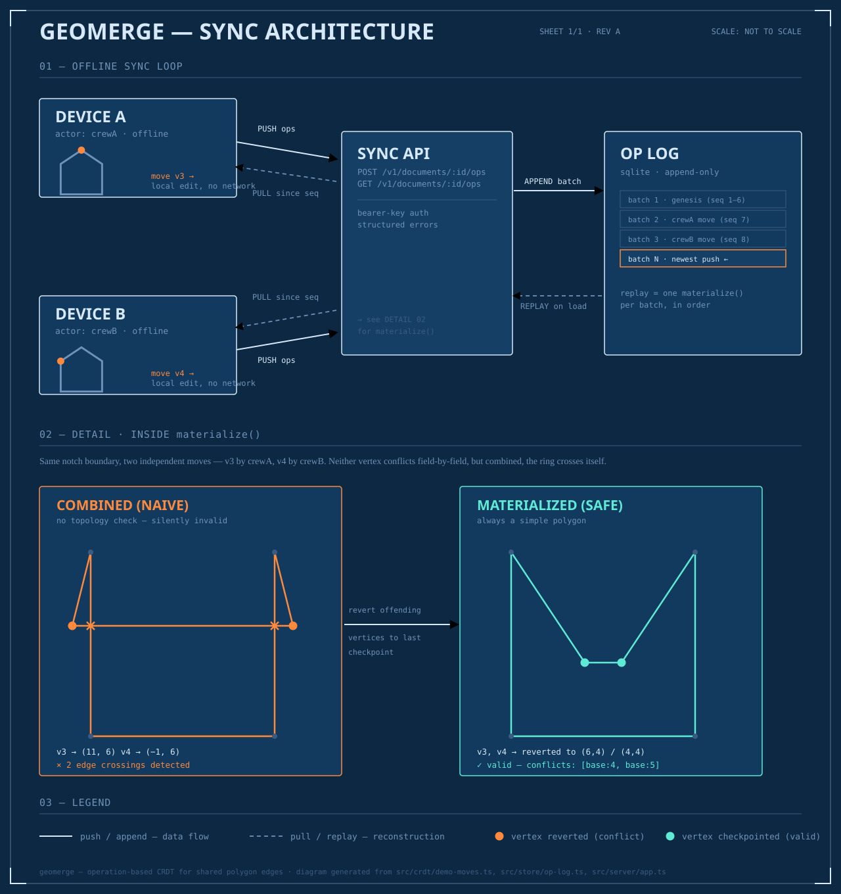

# Geomerge

> Topology-preserving offline sync for shared polygon edges.

Geomerge is a small conflict-free replication (CRDT) engine, sync service,
and reference client for editing polygons — think land parcels, utility
easements, or administrative boundaries — collaboratively and **offline**.
Multiple people, or devices, can edit the same shape (or two shapes that
share a boundary) independently with no network connection, and merge their
edits back together automatically. The merge is guaranteed to never produce
invalid geometry: it either resolves cleanly or tells you exactly which
edits it couldn't reconcile, instead of silently handing back a broken
shape.

## What problem this solves

Picture two survey crews editing the same parcel boundary offline — one
each end of a shared edge, on separate devices, no signal. Both edits are
individually reasonable. Naively merging them field-by-field (take
whichever value came in, vertex by vertex — how a plain diff or a
last-writer-wins merge works) can silently fold the polygon over itself: a
self-intersecting "bowtie" shape that's invalid input to almost every
downstream GIS tool.

General-purpose CRDT libraries (Automerge, Yjs, Loro) solve the *merge*
problem for text and JSON, but have no concept of geometric validity — they
don't know a self-intersecting ring is wrong. Geomerge adds that layer on
top of a real CRDT: after merging, it checks the resulting shape, and if
the combination of edits crossed an edge, it reverts exactly the vertices
responsible to their last known-good position and reports them — rather
than either corrupting the shape or refusing to merge at all.

## How it works



*Vector source: [`docs/architecture.svg`](docs/architecture.svg) · raster copy: [`docs/architecture.png`](docs/architecture.png).*

A few pieces, each doing one job:

- **Ops** (`src/crdt/ops.ts`) — every edit is an `insert`, `move`, or
  `delete` on one vertex, stamped with a Lamport clock id
  (`src/crdt/ids.ts`). A vertex's identity *is* the id of the op that
  created it — stable across edits, unlike an array index.
- **LWW registers** (`src/crdt/lww.ts`) — a vertex's position is a
  last-writer-wins register. Two concurrent moves converge to the same
  winner on every replica, regardless of which order they're applied in.
- **RGA** (`src/crdt/rga.ts`) — ring order (which vertices exist, and in
  what sequence) is a Replicated Growable Array, a list CRDT. This is what
  lets vertices be inserted and deleted, not just moved, while every
  replica still converges to the same order.
- **`PolygonDocument.materialize()`** (`src/crdt/document.ts`) — the
  topology guarantee, layered on top of the above two. It always returns a
  simple (non-self-intersecting) polygon: vertices whose combined edits
  crossed an edge get reverted to their last known-valid position and
  listed as conflicts, instead of being silently accepted or silently
  dropped.
- **`VertexStore`** (`src/crdt/vertex-store.ts`) — the actual "shared
  polygon edges" primitive the project is named for. Two
  `PolygonDocument`s (two neighboring parcels) constructed against the
  *same* `VertexStore`, referencing the same vertex id, are sharing that
  vertex's geometry. Move it through either parcel's edit stream and both
  see the new position — there's no separate reconciliation step, because
  there was never a second copy of the shared edge to reconcile.

On top of the engine:

- **Persistence** (`src/store/`) — an append-only op log on SQLite
  (`node:sqlite`), so a document's full edit history survives a restart —
  including the *incremental* checkpoint history `materialize()` needs to
  repair a future conflict correctly, not just the raw ops.
- **HTTP API** (`src/server/`) — the actual sync transport: a device pulls
  everything it hasn't seen (`GET /v1/documents/:id/ops?since=`), applies
  those ops locally in any order (the CRDT is what makes that safe), and
  pushes its own new ops back (`POST /v1/documents/:id/ops`).
- **Reference client** (`src/client/device.ts`) — the pull/edit-offline/push
  loop a real client follows, including the two correctness rules that
  aren't obvious until you build it (see the docstring): a push response
  isn't proof you're caught up, and ops must be de-duplicated by id before
  applying.

## Applications

This is the kind of tool you'd reach for wherever multiple people edit
overlapping or shared geometry without a reliable connection between them:

- **Land parcel / cadastral editing** — survey and county-records teams
  updating adjoining parcel boundaries, where two parcels genuinely share
  the same physical edge and both records need to agree on it.
- **Utility and telecom field crews** — marking easements, right-of-way
  boundaries, or service areas from a truck or a job site with no signal,
  syncing once back at the depot.
- **Collaborative GIS editors** — the merge layer underneath a
  Placemark-style web tool where several people edit the same map at once.
- **Conservation, agriculture, and disaster-response mapping** — field
  teams delineating plots, burn areas, or damage zones offline, merging
  results once reconnected.

Anywhere the alternative is "whoever syncs last wins, and hope the shape is
still valid," this replaces that with a guarantee.

## Tech stack

| Layer | Choice | Why |
|---|---|---|
| Language | TypeScript (strict) | The CRDT logic leans hard on discriminated unions and exhaustiveness; worth the type overhead. |
| Runtime | Node.js ≥ 22.5 | Needed for `node:sqlite`. |
| Persistence | `node:sqlite` | Built into Node — no native module to compile, no separate DB to run for a single-node deployment. |
| HTTP API | Express 5 | Small surface area (5 routes), no need for more. |
| Testing | Vitest, Supertest | Vitest for unit/CRDT convergence tests; Supertest for HTTP integration tests against the real Express app. |
| Dev runtime | tsx | Runs TypeScript directly, no build step, matches the "ugly working prototype" pace this started at. |
| CI | GitHub Actions | Typecheck + full suite on every push/PR. |

No geometry library (Turf, JSTS, etc.) — the self-intersection check
(`src/topology.ts`) is a plain segment-intersection sweep, since that's all
this needs and it keeps the dependency list short.

## Running it

```bash
npm install
npm test               # 53 tests: CRDT convergence, topology repair, persistence-across-restart, real HTTP sync
npm run typecheck

npm run demo           # concurrent moves: two crews drag opposite ends of a shared notch
npm run demo:insert    # concurrent inserts: two crews add a point on the same edge
npm run demo:shared    # two parcels sharing a boundary vertex stay consistent across a move
npm run merge -- fixtures/base.geojson fixtures/crew-a.geojson fixtures/crew-b.geojson

GEOMERGE_API_KEYS=dev-key npm run server   # API on :8787, sqlite at ./geomerge.sqlite
```

## API reference

All routes except `/healthz` require `Authorization: Bearer <key>` when
`GEOMERGE_API_KEYS` is set.

| Method & path | Body | Does |
|---|---|---|
| `GET /healthz` | — | Liveness check, no auth. |
| `GET /v1/documents` | — | List document ids. |
| `POST /v1/documents` | `{ id?, feature }` or `{ id?, ops }` | Create a document from a GeoJSON Polygon, or from a raw genesis op array. |
| `GET /v1/documents/:id` | — | Current materialized state as a GeoJSON Feature (`properties.conflicts`, `properties.valid`), plus the latest seq. |
| `POST /v1/documents/:id/ops` | `{ ops }` | Push a batch of ops (a client's local edits). Returns the assigned seq range and the new materialized state. |
| `GET /v1/documents/:id/ops?since=N` | — | Pull ops after seq `N`, for a device catching up. |

```bash
curl -X POST localhost:8787/v1/documents \
  -H "Authorization: Bearer dev-key" -H "Content-Type: application/json" \
  -d '{"id":"parcel-1","feature":{"type":"Feature","properties":{},"geometry":{"type":"Polygon","coordinates":[[[0,0],[10,0],[10,10],[0,10],[0,0]]]}}}'

curl localhost:8787/v1/documents/parcel-1 -H "Authorization: Bearer dev-key"
```

## Repository map

```
src/crdt/       the engine — ids, lww, rga, ops, document, vertex-store, geojson-adapter
src/store/      persistence — op-log (SQLite), document-store (replay + checkpointing)
src/server/     HTTP API — app, auth, validate, errors, main (entrypoint)
src/client/     reference sync client (device.ts)
src/topology.ts self-intersection check, shared by the CRDT engine and the snapshot path
src/merge.ts    a separate, simpler convenience path: one-shot diff of two GeoJSON
                snapshots against a common base, for when there's no op history at all
src/cli.ts      demo/merge command-line entry points
tests/          53 tests: RGA & LWW convergence, topology repair, persistence, HTTP, e2e sync
fixtures/       sample GeoJSON for the snapshot-diff path
```

## Known limitations, honestly

- **No interior rings or multi-polygon geometry.** Single outer ring only.
- **No real IAM.** `GEOMERGE_API_KEYS` is a flat bearer-token list — no
  scoping, rotation, or tenant isolation. Fine for a pilot, not for
  multiple customers on one deployment.
- **No horizontal scaling.** One SQLite file, one process. Real multi-node
  replication (or even just "two app servers behind a load balancer talking
  to one DB") isn't built.
- **RGA tie-break is the standard sibling-of-one-origin rule**, not the
  deeper interleaving-free ordering some list CRDTs add for heavily
  concurrent many-actor editing — fine for a handful of crews on one
  boundary, worth revisiting past that.
- **Ops are assumed delivered at most once per replica.** The client dedupes
  by id to protect against re-pulling its own already-applied ops, but
  there's no general exactly-once transport guarantee baked in below that.

## Project status

Released as open source under the MIT license. This started as a
market-validation prototype; commercial work on it isn't being pursued, so
the code is published as-is for anyone who finds it useful. It works and is tested, but
it is a prototype — read the limitations above before depending on it.
Issues and pull requests are welcome.

## License

[MIT](LICENSE) © 2026 Bishal Dhungana
