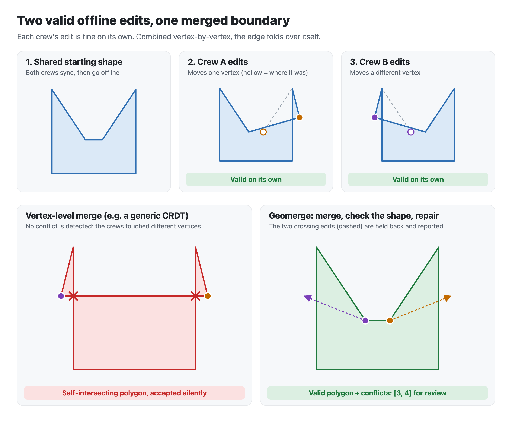

# Offline edits to shared boundaries: a neglected merge problem

Field crews edit maps offline all the time: surveyors on a parcel, utility
crews marking an easement, responders outlining a burn area. When two people
edit the same boundary without a connection and sync later, some piece of
software has to decide what the merged shape is.

Most tools make that decision without looking at the shape. This article
covers what goes wrong, how the main GIS platforms handle it today, and a
small open-source prototype ([Geomerge](../README.md)) that tries a
different approach.



## The problem

A polygon is only valid if its boundary doesn't cross itself. Validity
belongs to the whole shape, not to any single vertex. Two edits can each be
fine on their own and still produce an invalid shape when combined.

In the figure above, crew A moves one vertex and crew B moves a different
vertex. Each result is a valid polygon. A merge that combines them vertex by
vertex sees no conflict, because nobody touched the same vertex, and outputs
a self-intersecting shape. Most GIS processing, such as area, overlay and
buffering, either rejects that shape or quietly returns wrong numbers.

There are three ways this shows up in practice:

1. **An edit silently disappears.** The sync treats the whole geometry as a
   single value, and the last device to sync overwrites the other one. The
   shape stays valid, but one crew's work is gone and nobody is told.
2. **The shape silently breaks.** The sync merges at the vertex level, for
   example a general-purpose CRDT library storing coordinates as a list.
   Both edits survive, but the result can be invalid, as in the figure.
3. **Neighbours stop agreeing.** Two adjacent parcels share an edge, but
   each stores its own copy of it. Crews edit one parcel each, and the merged
   data now has a gap or an overlap between them.

## How the main platforms handle it

**Esri ArcGIS (Field Maps, offline map areas, replicas).** For hosted
feature layers and non-versioned data, Field Maps keeps
["the last edit synced"](https://doc.arcgis.com/en/field-maps/ios/use-maps/sync.htm)
(failure mode 1). For versioned enterprise data, conflicts go to a database
administrator to [reconcile and post](https://doc.esri.com/en/arcgis-pro/latest/help/data/geodatabases/overview/resolve-synchronization-conflicts-manually.html).
Replica sync detects conflicts [by row or by column](https://pro.arcgis.com/en/pro-app/latest/tool-reference/data-management/synchronize-changes.htm)
and resolves them in favour of one side, or leaves them for manual
resolution. Esri does address geometric validity, but only after the merge.
Its documentation says reconciling creates dirty areas
["so potential errors introduced by merging the changes from the two versions can be discovered"](https://doc.esri.com/en/arcgis-pro/latest/help/data/topologies/dirty-areas-created-as-a-result-of-the-reconcile-process.html),
and edits synced from a replica
["must be validated"](https://doc.esri.com/en/arcgis-pro/latest/help/data/geodatabases/overview/synchronization-and-topology.html).
In other words, Esri accepts that a merge can break topology, and relies on a
configured topology plus a later validation step, often manual, to catch it.

**QGIS + Mergin Maps.** Sync is built on
[geodiff](https://github.com/MerginMaps/geodiff), which uses the SQLite
changeset format, so a feature's geometry is one column value like any other.
Edits to different features merge automatically. When two people change the
same value,
["the editor who syncs last 'wins'"](https://merginmaps.com/docs/manage/synchronisation/)
and the overwritten version is saved to a conflict file for an admin to look
at later. The overwrite is recorded, which is better than nothing, but it's
still failure mode 1.

**OpenStreetMap.** OSM gets the shared-boundary part right: ways reference
shared nodes, so adjacent features really do share one vertex. Concurrent
edits are handled with version numbers. If you upload a change to an element
someone else changed first, the API returns
[HTTP 409 Conflict](https://wiki.openstreetmap.org/wiki/API_v0.6) and your
editor makes you resolve it by hand. Nothing breaks silently, but every
conflict needs a person.

**[PostGIS Topology](https://postgis.net/docs/Topology.html).** This stores shared edges once and keeps them
consistent, but it's a central database. It doesn't help two devices that
were offline at the same time.

**Collaborative web editors.** [Placemark](https://macwright.com/2023/11/13/placemark),
the closest thing to a collaborative geo editor built for this kind of work,
shut down in 2023. Its founder couldn't make it work as a bootstrapped
business, which says something about how small and hard to sell this niche
is.

### The pattern

| Approach | Keeps both edits? | Result always valid? | Tells you about conflicts? |
|---|---|---|---|
| Whole-geometry last-writer-wins (Field Maps hosted, Mergin Maps) | No | Yes | Mergin: yes, in a file. Field Maps: no. |
| Merge, then validate topology later (ArcGIS versioned + topology) | Depends on reconcile policy | Only after a validation step | Yes, as topology errors |
| Reject and resolve by hand (OpenStreetMap) | A person decides | Only if the person gets it right | Yes, immediately |
| Vertex-level merge with no shape check (generic CRDT) | Yes | **No** | No |

No mainstream tool merges concurrent edits to the same boundary
automatically *and* guarantees the result is valid. The likely reason isn't
that it's impossible. Most customers can live with occasional manual cleanup,
and the people who can't, such as field crews working without signal, are a
small and hard-to-sell market.

## What Geomerge does differently

Geomerge is a small TypeScript prototype that combines the good parts of the
approaches above:

- **Edits merge at the vertex level.** Every vertex has a stable identity,
  and ring order uses a list CRDT. Edits to different parts of a boundary
  both survive, unlike whole-geometry last-writer-wins.
- **The shape is checked as part of the merge.** Geomerge puts every edit
  into one fixed order (by Lamport clock, then device id) and applies them
  one at a time. An edit that would make the ring cross itself is held back
  and reported as a conflict. The output is always a valid polygon plus a
  list of what needs review, never a silently broken shape.
- **Shared edges are stored once.** Adjacent parcels can reference the same
  vertex, as in OSM, so they can't drift apart. Moving that vertex through
  either parcel moves it for both.
- **Every device reaches the same result.** The order depends only on the
  edits themselves, not on when each device received them, so any two
  devices holding the same edits compute the same polygon. A randomized
  test checks this across many arrival orders.

In the figure, the two edits really do conflict. Crew A's comes first in
the fixed order, so it's applied; crew B's would then cross it, so it's
held back and flagged for review. A feature-level sync would also keep only
one, but it would pick by who synced last and drop the other silently. When
edits don't cross, Geomerge keeps them all.

## Limits, honestly

This is a prototype, not a product:

- Single polygons only: no holes, no multipolygons.
- A self-intersection check only. It doesn't enforce rules like "must not
  overlap" between different features.
- One server process with a SQLite file, and basic API-key authentication.
- When edits conflict, which one wins is arbitrary: it's the one earlier in
  the fixed order, not the "better" one. The other is flagged for a person
  to review. It doesn't work out a clever combined shape.
- Shared vertices are checked per parcel. A move that's fine for one parcel
  but would break its neighbour is accepted by one and flagged by the other.

## Try it

```bash
git clone https://github.com/DBishal13/geomerge.git
cd geomerge && npm install
npm run demo      # the scenario in the figure, through the CRDT engine
npm test          # 56 tests: convergence, order-independent repair, persistence, HTTP sync
```

The code is MIT-licensed. If you work on offline field editing and have hit
this problem, or solved it differently, I'd like to hear how. Open an issue
on the repo.

## References

1. Esri. [Sync](https://doc.arcgis.com/en/field-maps/ios/use-maps/sync.htm). *ArcGIS Field Maps documentation.*
2. Esri. [Resolve synchronization conflicts manually](https://doc.esri.com/en/arcgis-pro/latest/help/data/geodatabases/overview/resolve-synchronization-conflicts-manually.html). *ArcGIS Pro documentation.*
3. Esri. [Synchronize Changes (Data Management)](https://pro.arcgis.com/en/pro-app/latest/tool-reference/data-management/synchronize-changes.htm). *ArcGIS Pro tool reference.*
4. Esri. [Dirty areas created as a result of the reconcile process](https://doc.esri.com/en/arcgis-pro/latest/help/data/topologies/dirty-areas-created-as-a-result-of-the-reconcile-process.html). *ArcGIS Pro documentation.*
5. Esri. [Synchronization and topology](https://doc.esri.com/en/arcgis-pro/latest/help/data/geodatabases/overview/synchronization-and-topology.html). *ArcGIS Pro documentation.*
6. Mergin Maps. [Synchronisation](https://merginmaps.com/docs/manage/synchronisation/). *Mergin Maps documentation.*
7. Mergin Maps. [geodiff: a library for handling diffs of geospatial data](https://github.com/MerginMaps/geodiff). *GitHub.*
8. OpenStreetMap Wiki. [API v0.6](https://wiki.openstreetmap.org/wiki/API_v0.6).
9. PostGIS. [Topology](https://postgis.net/docs/Topology.html). *PostGIS documentation.*
10. Tom MacWright. [Placemark is going open source and shutting down](https://macwright.com/2023/11/13/placemark). 13 November 2023.

*All links accessed September 2026.*
